# 🚀 Análisis e Implementación de un Módulo de Inteligencia Artificial como Sustituto de un Controlador PID en Sistemas de Control Industrial

📌 **Descripción breve:**\
Los controladores PID (de Acción Proporcional + Integral + Derivativo) por años han sido ampliamente utilizados en sistemas de control industrial (ejemplo, temperatura, nivel, flujo, velocidad, etc.), esto se debe a que su uso es simple y efectivo. Sin embargo, tienen limitaciones en cuanto a la adaptación a cambios dinámicos y no lineales en el sistema, para enfrentar estos temas se han desarrollado tecnologías como lazos de control feed forward, sistemas de Control Interno del Modelo ó IMCs.  

También se han desarrollado técnicas de sintonización para poder ajustar los parámetros de control (Kp, Ki, Kd, Bias, offset, clamping, Banda proporcional, Integral windup, etc. ) de tal manera evitar fenómenos como la saturación, el ruido de entrada, la sobre- ó sub-amortiguaión, etc., algunos ejemplos de estas técnicas mejoradas son: las reglas de Zigler-Nichols, Autotunning, fuzzy autotunning, Cohen-Coon, IMC, y Skogestad.  

La implementación de un módulo de IA podría ofrecer una solución más flexible y adaptativa pero se requiere investigar si es posible llegar a igualar o se puede superar el rendimiento de los controladores PID tradicionales.  

## Preguntas de investigación: 
-   Cómo se compara el rendimiento de un módulo de IA con un controlador PID tradicional en términos de estabilidad y precisión? 
-   ¿Qué técnicas de IA son más efectivas para reemplazar a los controladores PID en sistemas de control industrial? 
-   ¿Cuáles son las limitaciones y desafíos de implementar un módulo de IA en lugar de un controlador PID? 

```mermaid
mindmap
  root((Investigacion))
    Controladores PID:​
    ::icon(fa fa-industry)
      Definición
        Uso
            Amplio en sistemas de control industrial 
                temperatura
                nivel
                flujo
                velocidad
                PH
        Técnicas de Sintonización:
            Objetivo
                Ajustar parámetros de control
                    Kp
                    Ki
                    Kd
                    etc
            Evitar problemas
                Saturación
                Ruido
                Sobre/sub-amortiguación
        Ejemplos
            Reglas de Zigler-Nichols
            Autotunning
            Fuzzy autotunning
            Cohen-Coon
            IMC
            Skogestad.
        Ventajas
            Simplicidad
            Efectividad.
        Limitaciones
            Adaptación
                Dificultad con cambios dinámicos y no lineales.
        Soluciones
            Lazos de control cerrados
            Lazos en cascada
            Lazos feed forward
            Sistemas de Control Interno del Modelo IMCs
    Módulo de IA
        ::icon(fa fa-cogs)
        Potencial
            Ofrecer soluciones más flexibles y adaptativas.​
            Necesaria para evaluar si puede igualar o superar el rendimiento de los PID tradicionales.​
        Investigación
            Modelos adecuados para la aplicacion
                Tecnicas de Sintonizacion
                Análisis de datos
            Despliegue de modelo para produccion
                Sustitución del control
    ETL
    ::icon(fa fa-wrench)
        Tecnica de conexion
            API
            OPC
            OPCUa
        Tecnica de seriaizacion
            Airflow
        Ingesta de datos
            Raw Bulk Append data
                Jason
                CSV
        Extraccion
            Airflow
                Python Dags
                    Pandas 
                    AlchemySQL
                PostgreSQL
                    Staging Tables
```



## 📂 Estructura del Proyecto

```
├── dags/                # Flujos de trabajo de Apache Airflow
├── data/                # Datos de entrenamiento/prueba (ignorado en Git)
├── models/              # Modelos entrenados (ignorado en Git)
├── notebooks/           # Jupyter Notebooks para exploración
├── scripts/             # Scripts Python para procesamiento
├── secrets/             # Credenciales (ignorado en Git)
├── docker/              # Configuración de Docker
├── sql/                 # Archivos sql
├── .gitignore           # Archivos y carpetas ignoradas por Git
├── README.md            # Este archivo
└── requirements.txt     # Dependencias si no usas Poetry
```

## 🛠️ Instalación y Configuración

### 🔹 **Requisitos previos**

Antes de empezar, asegúrate de tener instalados:

- **Python** `>=3.8` (Usando `pyenv` o `conda`)
- **Poetry** (para gestión de dependencias)
- **Docker y Docker Compose** (para contenedores)
- **Apache Airflow**
- **PostgreSQL**

### 🔹 **Configuración inicial**

Clona el repositorio:

```bash
git clone https://github.com/tuusuario/tu-repositorio.git
cd tu-repositorio
```

Instala las dependencias con **Poetry**:

```bash
poetry install
```

Si usas **Docker**, inicia los contenedores:

```bash
docker-compose up -d
```

---

## 📌 Uso del Proyecto

### 🔹 **Ejecutar Jupyter Notebook**

```bash
poetry run jupyter notebook
```

### 🔹 **Ejecutar Airflow**

```bash
poetry run airflow standalone
```

### 🔹 **Ejecutar un Script de Entrenamiento**

```bash
poetry run python scripts/entrenamiento.py
```

---

## 🔧 Configuración de Variables de Entorno

Las credenciales y configuraciones sensibles están en `secrets/`. Usa un archivo `.env` con este formato:

```env
DB_HOST=localhost
DB_PORT=5432
DB_USER=postgres
DB_PASSWORD=tu_password
```

---

## 📄 Licencia

Este proyecto está bajo la licencia **MIT**. Consulta el archivo `LICENSE` para más detalles.

---

## ✨ Contribuciones

Si deseas contribuir:

1. **Haz un fork** del repositorio.
2. Crea una **nueva rama** (`feature/nueva-funcionalidad`).
3. Envía un **pull request**.

---

## 📫 Contacto

Si tienes preguntas o sugerencias, contáctame en ✉️ [**tuemail@example.com**](mailto\:tuemail@example.com).

---

### **💡 Notas finales**

✅ **Explicación clara** con una estructura ordenada.\
✅ **Incluye pasos de instalación y ejecución**.\
✅ **Configuración con **``** para credenciales**.\
✅ **Fácil de entender para colaboradores**.

